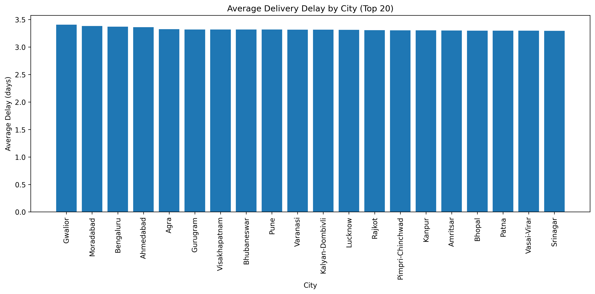
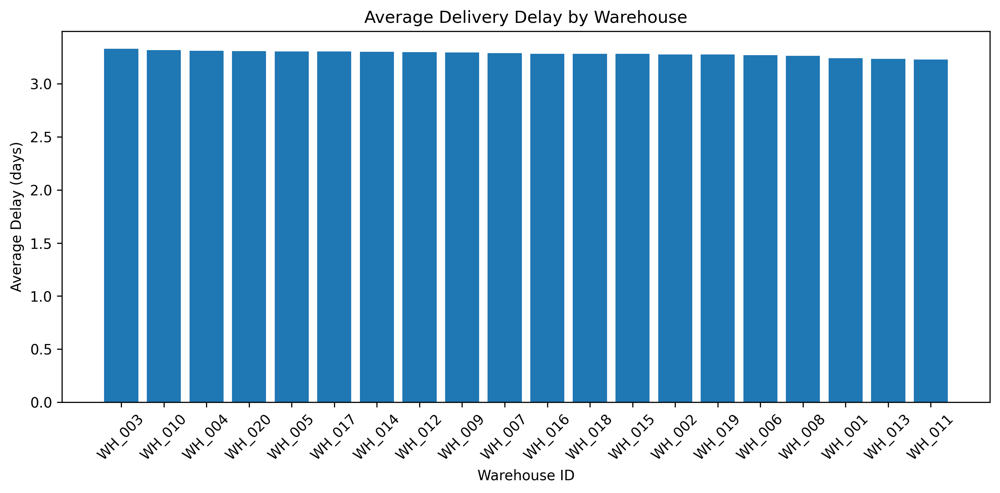
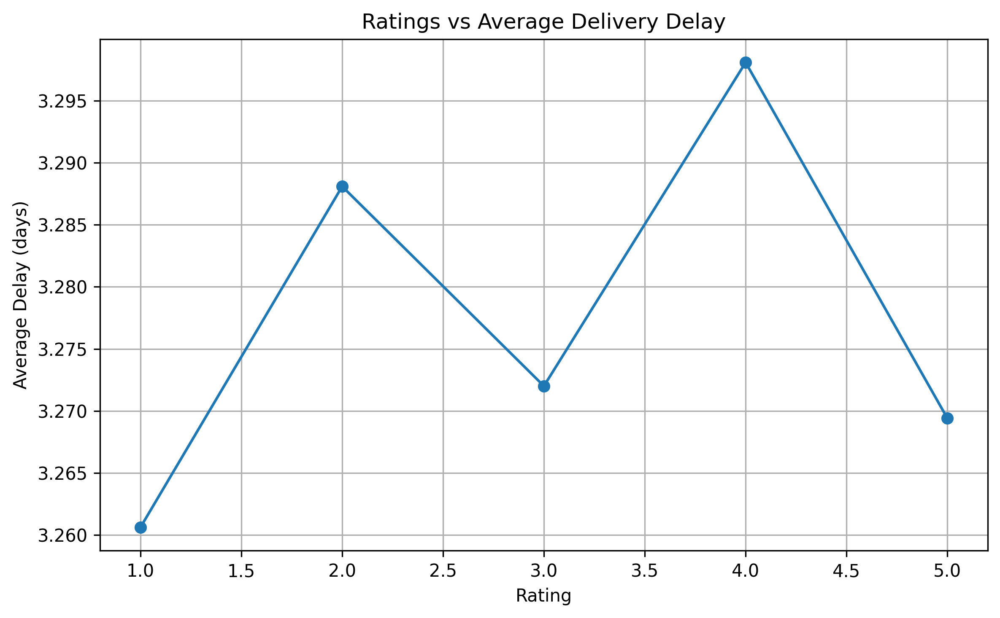
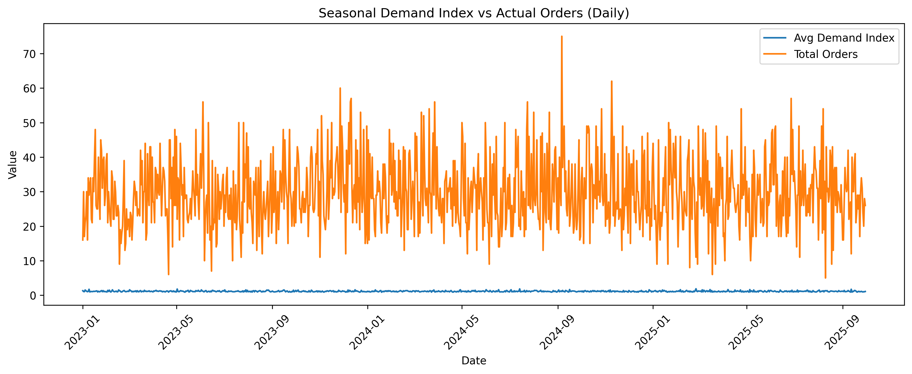

# Amazon Supply Chain Analysis

## Project Overview

This project analyzes key supply chain performance metrics including delivery delays, warehouse performance, courier efficiency, and seasonal demand patterns.

The objective is to identify operational bottlenecks and improve supply chain decision-making using data analytics.

## Technologies Used

* Python
* SQL
* MySQL
* Pandas
* Matplotlib

## Analysis Performed

* Warehouse performance analysis
* Delivery delay analysis
* Courier performance evaluation
* Seasonal demand forecasting
* Customer rating vs delivery delay analysis

## Key Visualizations

### Average Delay by City

### Average Delay by Warehouse

### Ratings vs Average Delay

### Seasonal Demand vs Orders

## Business Insights

* Identified cities with the highest delivery delays.
* Compared warehouse efficiency across locations.
* Evaluated the impact of delivery performance on customer ratings.
* Analyzed seasonal demand trends to support inventory planning.

## Files Included

* analysis.py
* courier_performance.py
* Ratings_vs_Delay.py
* SQL database design (EER Diagram)

## Author

Shivaraj Khot
MBA – Operations & Business Analytics
